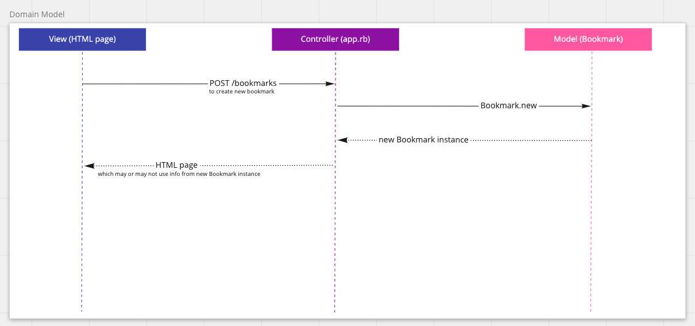
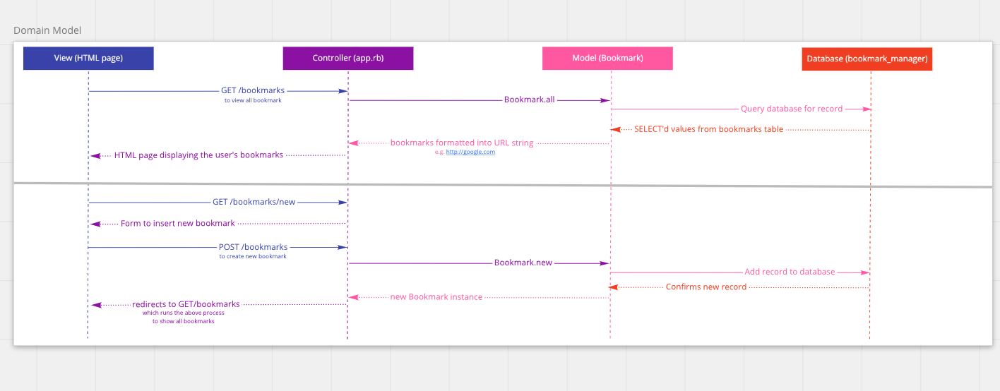

# Bookmark Pairing Challenge
An exercise is learning how to incorporate databases into our projects as well as consolidating last week's learning on 'The Web'.

## User Stories
```
As a user,
So that I can easily navigate to my most used websites,
I want to see a list of bookmarked websites

As a time-pressed user
So that I can save a website
I would like to add the site's address and title to bookmark manager
```
## To set up the database
Connect to `psql` and create the `bookmark_manager` database:
```
CREATE DATABASE bookmark_manager;
```
To set up appropriate tables, connect to the databse in `psql` and run the SQL scripts in the 'db/migrations' folder in the given order.

To set up the **test environment**, repeat the above steps with the database name `bookmark_manager_test` instead.

## Domain Models
1 - The below is a rough domain model of the first user story, completed before any coding was done.


2 - This model (an update of the previous one) was completed after completing the necessary code to get the `GET /bookmarks` to function using a database. This this model shows a plan of how I expect the programme to satisfy the second user story.

